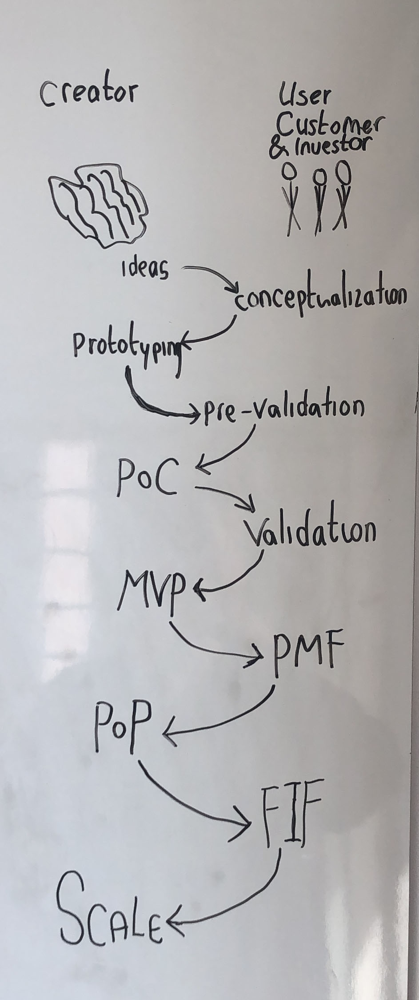

# LECKR-Landing: Stages of B2C SaaS Startups

LECKR Landing makes it possible to make landing pages very quickly to test a value proposition. 

With leckr-landing, all strategies and software for execution of them will be thought out, from pre-validation to PoC. The landing page will change in all stages.

Using this library and the documentation around it, you should be able to build a landing page with all things around it within a few hours, and test the value proposition within a few days.

## Goal

* Know projected Cost Per Install (CPI)
* Know viral reach per install per retention attempt (VRPIPRA)
* Know purchase ratio (CPP)
* Easily A/B test multiple sites
* Optimize to combination of those (modeled out over time and money)
* Test new ideas within a day
* Get feedback before making an app

This is the real µ-Cycle, the hyper sprint to pre-validate ideas super quickly.
After an idea pre-validates, your promise is good enough and you can build a PoC that delivers.
Then, of course, it's still the question wether or not people will actually use it. 
Also, it's a question wether or not people will pay, but you can even test this before making the app!

## Ideal flow of new ideas

Instead of making a new app every time and work 6 months before converting anything, the flow should be more like this:

1) Buy a domain
2) DNS to Surge
3) Define value propositions
3) Create assets for the landing page and FB ads for a few value propositions I want to A/B test. As many as I like. 
4) Create new leckr-landing object and deploy everything
5) Improve the site a bit if necessary (probably not)
6) Post a story on show-hn, indie-hackers, medium, producthunt, etc. Learn from feedback and see how it converts. If feedback is positive and reach is big, continue. Otherwise, go back to 3, or, if nobody wants it at all: quit.
7) Create an Ad on Facebook or Google or even a general App platform like Adjust, that leads to the landing page. Measure everything (CPI, CPP, VRPIPRA).
8) Catch converting pixels, create lookalike audience and target Ad on them. 
9) Measure everything again. Estimate projection of CLV. These stats now are good projectsions of when the app is real. 
10) Model this on time and costs, and see if it's worth a shot.

Of course, you should deliver on the value propositions, so keep it simple. If you do deliver, then you can count on long-lasting users, and then CLV will be very high. It can be huge if people already are willing to pay without using the app. This should always be tried.

# The Stages

* Stage A) Ideas & Conceptualization
* Stage B) Prototype & Pre-Validation
* Stage C) PoC & Validation
* Stage D) MVP & PMF
* Stage E) FiF & Seed
* Stage F) Grow

## A) Ideas & Conceptualization (±8h)

The most important step not to skip. Perfection may take up to a few days, but a first version can be made within ±4 hours.

A1) Get ideas

A2) Market research

A3) Discussion with friends

A4) Look if there's demand through sites like Udemy. A course can teach you what people want, if you bring it in an app.
- [Example](https://www.udemy.com/courses/search/?src=ukw&q=network+building)
- [Example 2](https://www.udemy.com/courses/search/?q=relationship%20building&src=sac&kw=building%20re)

A3) Extensive Lean Canvas (why, how, rough USP definition, virality estimation, marketing estimation, business model, critical mass, chicken and egg estimation, estimated money needed to be viable, sales needed estimation)

Goal: Figure out if it's probably viable

## B) Prototype & Pre-validation (±16h)

If the concept doesn't feel good, quit. If the concept feels and looks good on paper, it's time to prototype & pre-validate. Before making the app, it's important to get some feedback.

B1) Read about techniques that suit validating and prototyping your SaaS product: Examples: [1](https://ryanbattles.com/post/product-validation-techniques) [2](https://briancasel.com/validating-a-saas-product-step-by-step/) and more (search for [SaaS validation](https://www.google.com/search?q=saas+validation&oq=saas+validation&aqs=chrome..69i57j69i60l2.1416j0j4&sourceid=chrome&ie=UTF-8).)

B2) Create a landing page, assets and copy for multiple target-audiences and/or varying copy

B3) Set up nice basic landing page funnel "BLPF": Basic landing page -> Email -> Form -> Follow up form -> Status updates
NB: You can also enable pre-launch sharability features and pre-order options, in order to measure CPP and VF

B4) Add Channels that lead early adopters to the BLPF:

- FB, Google & other Ads ($0.01C per view, ±$1-5 per click)
- ProductHunt announcement
- Reddit
- Show HN
- Forums
- Organize or join meetups, events, conferences
- Invite a group of friends for a feedback session

B5) Evaluation: Evaluate KPI's and feedback, tweak website copy, send this to advisors & potential investors.

Goal: at least 100 filled in forms.

## C) PoC & Validation (±80h)

If the ads conversions and form-feedback are promising, continue. Otherwise, go back to the ideas stage, or give up. Now it's time to really spend some time.

C1) Build & test the app myself

C2) Get 4 testers from early adopters that have the right devices (Old & New, iPhone & Android)

C3) Iterate over feedback

C4) Email all early adopters to invite for the BETA

C5) Iterate over feedback again

C6) Measure KPI's (especially retention and virality), possibly by sending a few surveys (for money) or doing this manually

Goal: Lots of feedback and good KPI indication to decide to continue and in which direction

## D) MVP & PMF (±160h and $±10k for Ads)

If users keep using it and it still looks promising, it's time to really make a monetizable product out of this, and invest at least the same $ as your time is worth on advertising to get a little userbase going. 

D1) Define & Build product into a monetizable thing, ready for growth, analytics & virality

D2) Open up the landing page, improve it, continue with ads (#1)

D3) Tweak funnels, try to earn money back

D4) Estimate KPI's, make them promising

Goal: Earn money back as fast as possible, or quit if you figure out you won't

## E) FiF & Seed (±80h)

At this point, you're either deciding to bootstrap or raise money, based on circumstances. Of course, this step can be skipped if you plan to bootstrap for sure. This step almost always overlaps with the previous one.

E1) Show KPI's to potential investors (can also be the crowd)

E2) Talk to many investors

E3) Go with the best deal, or not.

Goal: Get some funding for a bit of equity to be able to grow much faster.

## F) Grow (±∞)

Now, tweaking growth should be the main goal. There are many KPI's for this. Some very interesting ones are the Viral Factor, TTEYMB (Time to earn your money back), and the more famous CAC:CLV ratio. Also, userbase churn should not be forgotten. 

---------

# LECKR-Landing is based on....

A React implementation of the [New Age theme by Start Bootstrap](https://github.com/BlackrockDigital/startbootstrap-new-age) that showcases how to approach the components architecture for a React app with self-contained presentational components.

## Getting Started

This project was bootstrapped with [Create React App](https://github.com/facebookincubator/create-react-app) and it keeps the same CLI scripts.

- Use `npm start` or `yarn start` to serve the app locally
- Use `npm test` or `yarn test` to run the tests

## Folder Structure

There are 4 main folders inside `src/`:

- `components/` - It contains a folder per component, which in turn contains all the component assets and test file. Having all the components under a single folder is intentional in this case, but real world projects require a different strategy for scalability.
- `pages/` - It contains a folder for each page in the app. Again, each page folder contains all the assets the page need and the test file. A page is in the end a component but with a different status, which is why it's useful to keep the in a separate folder.
- `services/` - In this folder you will find utilities, helpers, API libraries, etc.
- `styles/` - It contains global SASS modules.

## Introduced Dependencies

### General Dependencies

- `react-router` - A declarative routing utility. It's used to give an example of how to create multiple routes for the app while all pages stick to the same structure.
- `classnames` - An utility for conditionally joining classNames together.
- `lodash.throttle` - A throttle function.

### Styling Related Dependencies

The following dependencies were introduced in order to reuse most of the code from the original template which was done over Boostrap 4:

- `node-sass-chokidar` (and `npm-run-all`) - Node bindings to SASS.
- `bootstrap` and `reactstrap` - React Bootstrap 4 components.
- `html5-device-mockups` - HTML5 mockups of popular devices.

Fonts & Icons:

- `simple-line-icons`
- `font-awesome`
- `typeface-catamaran`

### Dev dependencies

- `enzyme` and `enzyme-adapter-react-16`
- `jest-cli`
- `eslint`, `eslint-plugin-react` and `eslint-config-airbnb`
- `sass-lint`
